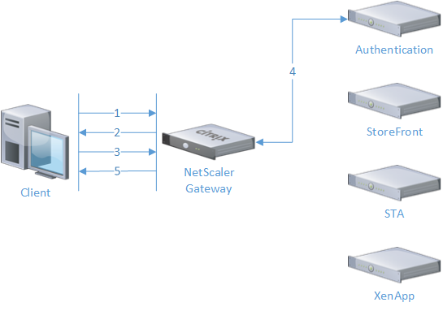
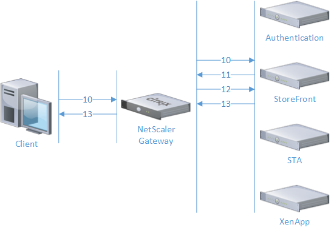
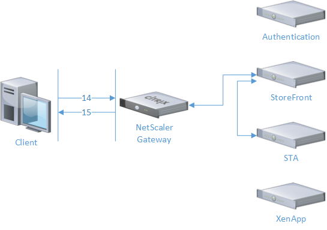
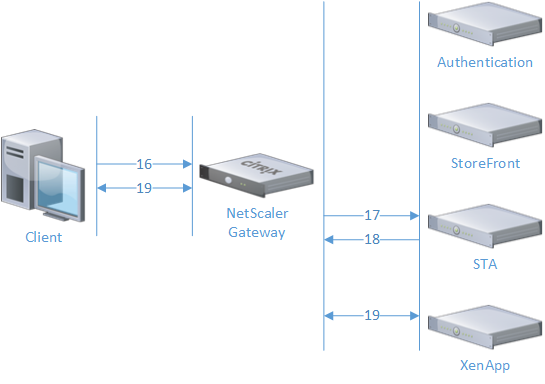

# ICA Proxy Traffic Flow

1. The client sends a request to the FQDN of vpn vserver (HTTP `GET`).

1. The vpn vserver determines the type of the incoming connection to be unauthenticated HTTP and redirects the client to the authentication page (`HTTP 302`; `Location: /vpn/index.html`).

1. The client sends the entered credentials to the vpn vserver (HTTP `POST /cgi/login`).

1. The NetScaler verfies the credentials on the backend.
	1. If a second factor authentication (e.g., RADIUS) server responds with a challenge (i.e., `Access-Challenge`).
		1. The vpn vserver responds with a request for the challenge response (i.e., one-time password) (`HTTP 200`).
		1. The client sends the challenge response to the vpn vserver (HTTP `POST /cgi/dlge`).

1. The vpn vserver sets authentication cookies and redirects the client to a "set client" page based on the HTTP User-Agent header from the client (`HTTP 302`; `Location: /cgi/setclient?cvpn`).

	

1. The client sends the request including authentication cookies (HTTP `GET /cgi/setclient?cvpn`).

1. The vpn vserver determines the type of incoming connection to be authenticated HTTP and redirects the client to `/vpns/cvpnpage.html` (`HTTP 302`).

1. The client sends the request including authentication cookies (HTTP `GET /vpns/cvpnpage.html`).

1. The vpn vserver redirects again to StoreFront (SF) or Web Interface (WI) page via Clienteles VPN: `/cvpn/https/storefront.internal.com/Citrix/StoreWeb` (`HTTP 302`).

	

1. The client sends the request including authentication cookies (HTTP `GET /cvpn/https/storefront.internal.com/Citrix/StoreWeb`).

1. The SF/WI server performs a single sign-on (SSO) call-back to the vpn vserver (HTTP `POST /CitrixAuthService/AuthService.asmx`; `<GetAccessInformation [...]>`).

1. The vpn vserver responds to SF/WI including any Smart Access information (`HTTP 200`; `<GetAccessInformationResult>`).

1. The SF/WI server enumerates the user's applications and presents them to the client via Clienteles VPN  (`HTTP 200`).

	

1. The user launches (clicks on) an application (HTTP `GET`).
	- Store Front: `/cvpn/https/storefront.internal.com/Citrix/StoreWeb/Resources/LaunchIca/[...]`
	- Web Interface: `/cvpn/https/webinterface.internal.com/Citrix/XenApp/site/launcher.aspx[...]`

1. The SF/WI server constructs and sends an ICA file (`HTTP 200`).
	- `Address` contains the STA information (`;STA_VERSION;STA_SERVER_ID;STA_TICKET`, see below)
	- `SSLProxyHost` contains the FQDN and TCP port number of the gateway

	

1.  Receiver is launched with the ICA file and sends a SOCKSv5 `CONNECT` to the server.
	- `address type` (field 4) is domain name (`0x03`)
	- `destination address` (field 5) is the STA ticket

1. The vpn vserver determines the type of incoming connection to be SOCKSv5 and handles the proxy connection.
	- The NetScaler inspects the connection data to determine the type of connection (protocol) based on a byte sequence signature.
	- If the inspected bytes match a protocol signature, the handler registered with that signature is called.
	- These handles consist of HTTP, SOCKSv5, and CGP.
	- The current implementation assumes that SOCKSv5 and CGP connections are coming from an ICA client.

1. The NetScaler performs a data request by sending the STA ticket back to the STA server and requesting its corresponding data. (`<RequestData>`).

1. The STA server forwards the original data to the gateway. (notably, `<Value name="CGPAddress">` and `<Value name="ICAAddress">`).

1. This data is used to complete the subsequent proxy requests from Receiver via SOCKSv5.

## STA Ticket Encoding Format
`;STA_VERSION;STA_ID;TICKET`
- `STA_VERSION` - a numeric field identifying the version of the STA.
  - `10` - STA versions 1.0 and 1.1
  - `20` - STA version 2.0
  - `22` - STA version 2.2
  - `40` - STA version 4.0 (Required for Session Reliability)
- `STA_SERVER_ID` - a sequence of 0 - 16 characters representing a hash of the server name.
  - When multiple STAs are shared by a single gateway server, each STA ID must be unique. This allows the gateway to locate the STA that created the ticket and return to that STA for ticket validation. (A ticket created on STA01 will not exist on STA02.)
- `TICKET` - a randomly generated sequence of 32 (uppercase) alphanumeric characters.
